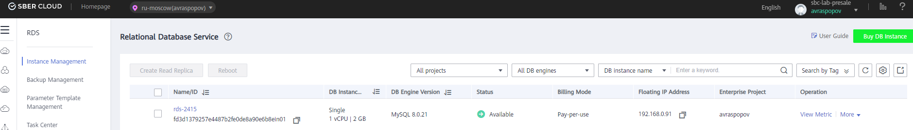
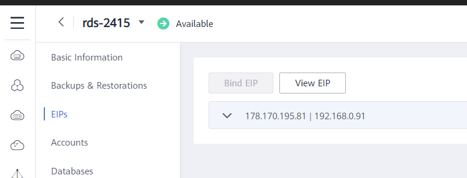

# Создание сервера баз данных
Открываем консоль облака, и в разделе Databases выбираем Relational Database Service. В верхнем правом углу нажимаем кнопку But DB Instance, и в открывшемся окне указываем необходимые настройки:

1. Имя создаваемого сервера баз данных
2. Тип базы данных – выбираем **MySQL**
3. Версию – нам не принципиально, так что выбираем последнюю – 8.0
4. Тип – Primary/Standby ил Single. Для теста нам подойдет и база без отказоустойчивости (и более дешевая) – **Single**.
5. **AZ** – выбираем любую, не принципиально в нашем случае.
6. **Instance Class** – выбираем самую маленькую. Все равно в ней будет очень мало записей и никакой нагрузки.
7. Тип storage – выбираем **High I/O** (он дешевле)
8. И указываем к какой виртуальной сети и подсети в ней (VPC) подключить данную базу. Так же можно вручную указать, какой ip адрес будет назначен, но можно оставить это поле пустым, и он будет назначен автоматически.
9. К выбору Security Group нужно подойти ответственно – это настройки фаервола, и если в них ошибиться, то можно долго пытаться понять, почему у нас нет доступа к базе данных.

   a. Нажимаем View Security Group, выбираем ту, которую мы будем использовать (или создаем новую)
   
   b. Переходим на вкладку Inbound Rules
   
   c. Создаем новое правило, в котором разрешаем порт 3306, и источник данных – используемая Security Group. Это позволит всем сервисам, расположенным в облаке, и в данной security group, иметь доступ до сервера баз данных.

   d. Нажимаем OK и возвращаемся к созданию сервера баз данных

10. Далее указываем пароль администратора сервера баз данных, и подтверждаем его.

11. Выбираем Enterprise Project, и нажимаем кнопку Buy Now.

12. Проверяем, что все настройки верны, и нажимаем кнопку Submit.

Создание сервера баз данных занимает минут 20-25 в среднем. Дожидаемся её создания, и проверяем, что она появилась в списке наших RDS.

Для доступа к базе данных имеется две опции: через публичный интернет и только из виртуальной сети облака.

В случае, если мы не хотим публиковать сервер баз данных в интернет, и готовы в дальнейшем настроить работу функций для работы в виртуальной сети, следующий абзац можно пропустить, и переходить к разделу «создаем базу данных».

Для тестирования и разработки удобно иметь доступ к базе через интернет – тогда вы можете разрабатывать свое решение локально на компьютере, а потом разместить его в облаке и переключить доступ на только из виртуальной сети. Для доступа к серверу баз данных через интернет необходимо добавить ему публичный ip адрес. Открываем настройки нашего сервера баз данных и переходим на вкладку EIP. Нажимаем кнопку Bind, и выбираем какой ip адрес из имеющихся привязать к данному серверу. Если никакие ip адреса еще не созданы – создаем его.
