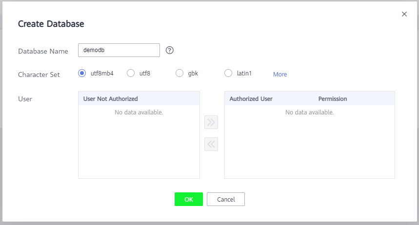
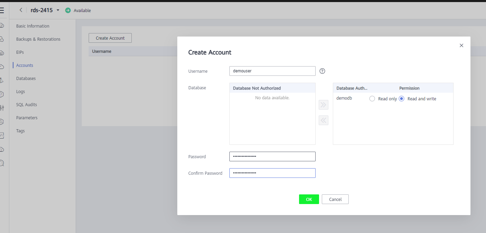
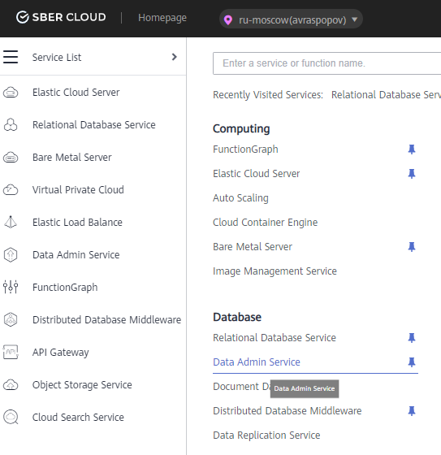
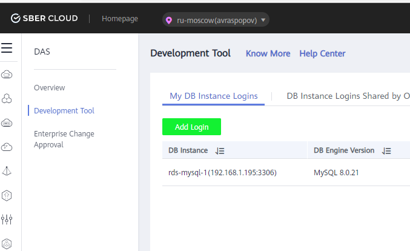
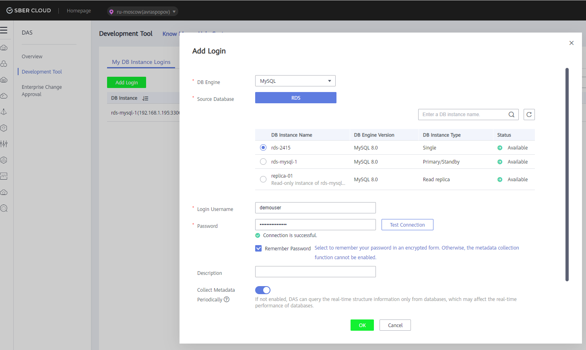
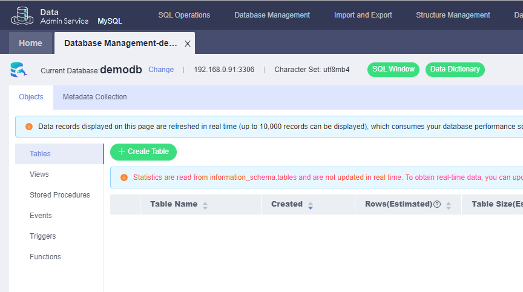
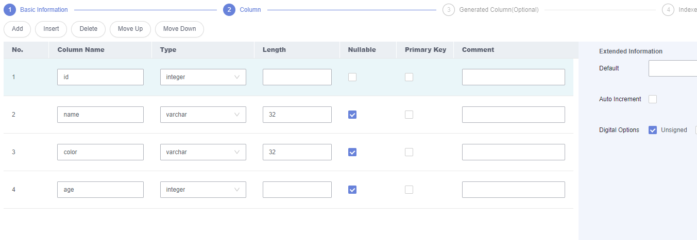
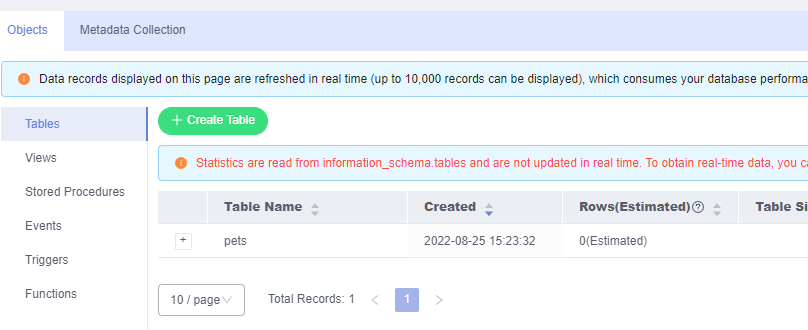

# Создание базы данных
Далее нам необходимо создать саму базу данных и таблицу в ней, и создать пользователя для доступа к ней. 
Нажимаем на имя созданного сервера баз данных, и переходим на вкладку Databases. Нажимаем кнопку Create Database. Указываем имя создаваемой базы данных, и нажимаем OK.

 
База создана, далее необходимо создать учетную запись для доступа к ней. Для этого переходим на вкладку Accounts, и нажимаем кнопку Create Account. Указываем имя создаваемой учетной записи, её пароль, и выдаем ей права на созданную ранее базу данных.

**Необходимо предоставить права на чтение и запись, так как наше API будет выполнять разные операции**

Если все было сделано правильно, то теперь у нас имеется развернутая база данных и учетная запись для подключения к ней.
Теперь нужно создать таблицу, в которой мы в дальнейшем будем создавать и удалять записи. Для демо давайте создадим простую таблицу, в которой будем хранить информацию о домашних питомцах: имя питомца, имя его владельца, окрас и возраст. Чтобы создать таблицу удобно использовать сервис Data Admin Service. Выбираем его в списке всех сервисов. 

И переходим на вкладку Development Tool

 
Здесь необходимо создать подключение к созданному ранее MySQL. Для этого нажимаем кнопку Add Login, в открывшемся окне выбираем нужный сервер баз данных, указываем учетную запись и её пароль, отмечаем галочки Remember Password, Collect Metadata и Show Executed SQL Statements. Далее нажимаем кнопку Test Connection и убеждаемся, что мы можем подключиться к серверу баз данных, и нажимаем OK.

 
Далее нажимаем Log In для доступа к базе данных, и в открывшемся окне выбираем созданную ранее базу данных – demodb.

 
Теперь мы можем создать нужную нам таблицу. Нажимаем Create Table, указываем имя таблицы – pets, нажимаем Next, и указываем какие поля таблицы мы будем создавать.
1.	ID. Тип – integer, и выбираем для этого поля auto increment
2.	Name. Тип – varchar
3.	Color. Тип – varchar
4.	Age. Тип – integer

 
Далее Next – Next – Create. В окне подтверждения смотрим какой SQL запрос будет выполнен для создания таблицы, и нажимаем execute. Убеждаемся, что таблица была успешно создана.
 

## SQL запрос для создания таблицы
Готовый запрос для создания таблицы можно найти [тут](https://github.com/zzindexx/cloud-static-site-function-graph/blob/main/source/database/create_table.sql).