# Создание функций Function Graph
В данном разделе описано создание бессерверных функций, которые будут выступать в роли API для нашего сайта.

Если вы не хотите создавать функции с нуля или у вас не установлено необходимое ПО для разработки, можно использовать уже готовые функции и следовать инструкции в разделе **Использование готовых функций**

## Функция создания записи о питомце (NodeJS)
Данная функция будет реализовывать метод POST, принимать на вход json с необходимыми тремя параметрами: имя питомца, его цвет и возраст, и выполнять запрос к базе данных для создания записи.

Для создания функции необходимо:
1. Создать директорию для хранения кода функции
1. Инициировать проект
   ```
   npm init -y
   ```
1. Установить зависимости
   ```
   npm install mysql2
   ```
1. Создать файл index.js и добавить в него следующий код:
   ```javascript
    exports.handler = async (event, context) => {
        const mysql = require("mysql2/promise");
        const db_connection = await mysql.createConnection({
            host: process.env.DB_HOST,
            user: process.env.DB_USER,
            database: process.env.DB_NAME,
            password: context.getUserData("DB_PASSWORD")
        });

        let buff = new Buffer(event.body, 'base64');
        let data = JSON.parse(buff.toString('utf8'));

        var insert_sql = "INSERT INTO pets (Name, Color, Age) VALUES (?, ?, ?)";
        var get_inserted_sql = "select * FROM pets where id =?"

        const [insertMetadata] = await db_connection.query(insert_sql, [data.name, data.color, data.age]);
        const [rows, fields] = await db_connection.query(get_inserted_sql, insertMetadata.insertId);

        
        const output =
        {
            'statusCode': 200,
            'headers':
            {
                'Content-Type': 'application/json'
            },
            'isBase64Encoded': false,
            'body': JSON.stringify(rows[0]),
        }
        
        db_connection.end();
        return output;
    }
   ```

1. Перейти в директорию с кодом, выделить все файлы (index.js, package.json, package-lock.json и папка node_modules) и создать zip архив


Для загрузки функции в облако необходимо выполнить следующие шаги:
1. В списке всех сервисов находим FunctionGraph

   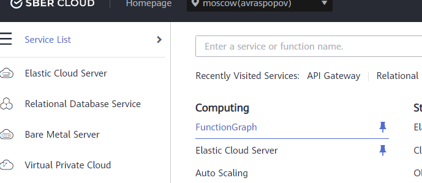

1. Нажимаем кнопку Create Function

   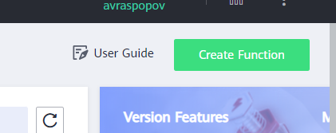

1. Проверяем, что выбрана опция Create From Scratch 

   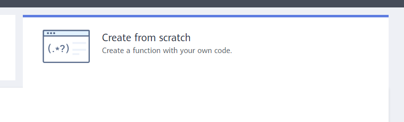

1. В разделе Basic Information указываем следующее:
   
   a. FunctionGraph Version – оставляем по умолчанию

   b. Function name- указываем имя создаваемой функции

   c. App – оставляем по умолчанию

   d. Agency – оставляем use no agency

   e. Enterprise Project – оставляем по умолчанию

   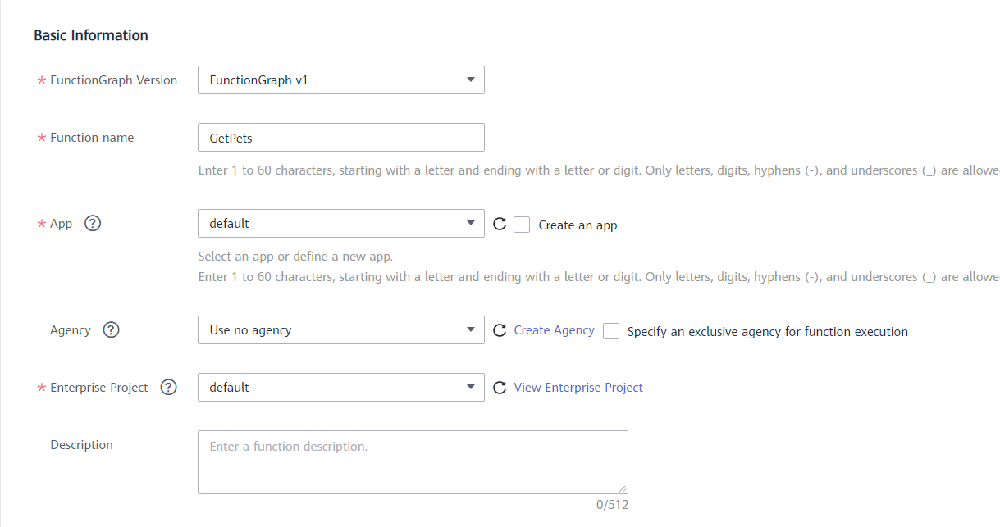


1. В разделе Function Configuration указываем следующее:

   a.Runtime – выбираем Node.js 12.13

   b. Handler – имя файла и имя функции, которая должна запускаться - оставляем по умолчанию, если использовали код из примера

   c. Code Entry Mode – выбираем Upload ZIP

   d. Указываем путь к архиву с исходным кодом нашей функции (создан на шаге 5 алгоритма создания кода функции) и нажимаем Create Function

   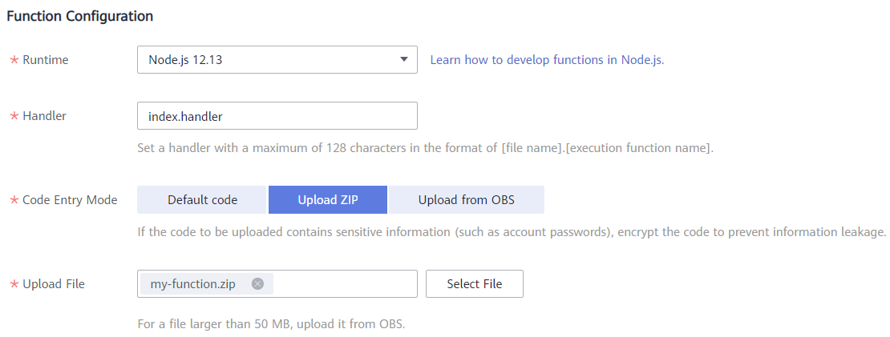

Если функция была успешно создана, то мы увидим окно с её настройками.

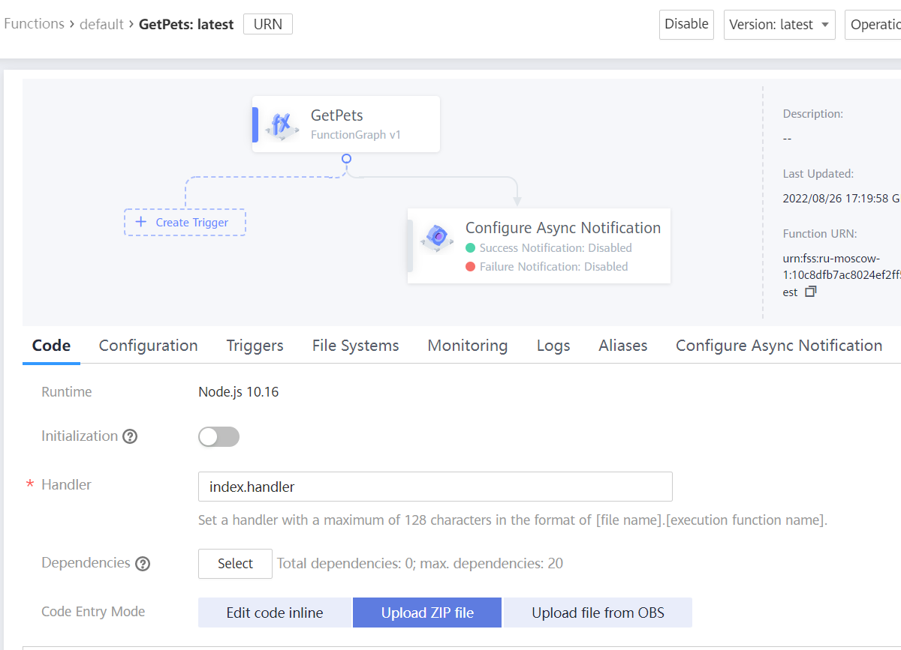

Функция ожидает несколько переменных окружения для своей работы и их необходимо указать:
1. В списке функций нажимаем на созданную функцию
1. Открываем вкладку Configuration
1. В разделе Encryption Settings нажимаем кнопку Add и добавляем настройку:
   
   * Key - DB_PASSWORD
   * Value - Пароль пользователя для доступа к базе данных
1. В правой части таблицы нажимаем кнопку Save
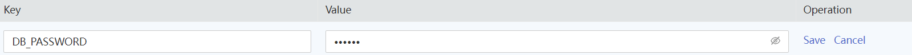

1. В разделе Environment Variables нажимаем кнопку Add и добавляем несколько настроек:
   * Адрес экземпляра базы данных
      * Key - DB_HOST
      * Value - IP адрес базы данных (можно указать публичный)
   * Имя пользователя для доступа к базе данных
      * Key - DB_USER
      * Value - имя пользователя
   * Имя базы данных
      * Key - DB_NAME
      * Value - имя созданной базы данных

1. Нажимаем кнопку Save около каждой настройки
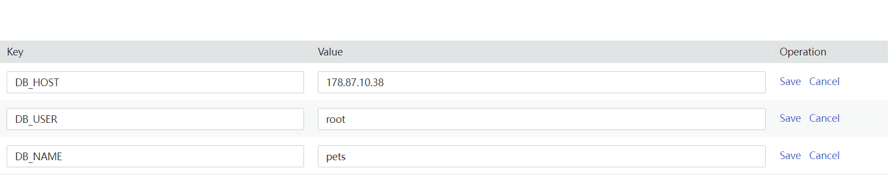

1. В правой верхней части экрана нажимаем кнопку Save, чтобы сохранить функцию


## Функция получения записей о питомцах (NodeJS)
Данная функция будет реализовывать метод GET, не будет принимать никаких параметров и будет возвращать все записи из базы данных.

Для создания функции необходимо:
1. Создать директорию для хранения кода функции
1. Инициировать проект
   ```
   npm init -y
   ```
1. Установить зависимости
   ```
   npm install mysql2
   ```
1. Создать файл index.js и добавить в него следующий код:
   ```javascript
    exports.handler = async (event, context) => {
        const mysql = require("mysql2/promise");
        const db_connection = await mysql.createConnection({
            host: process.env.DB_HOST,
            user: process.env.DB_USER,
            database: process.env.DB_NAME,
            password: context.getUserData("DB_PASSWORD")
        });
        var sql = "select * FROM pets";
        const [rows, fields] = await db_connection.query(sql);

        const output =
        {
            'statusCode': 200,
            'headers':
            {
                'Content-Type': 'application/json'
            },
            'isBase64Encoded': false,
            'body': JSON.stringify(rows)
        }
        db_connection.end();
        return output;
    }
   ```

1. Перейти в директорию с кодом, выделить все файлы (index.js, package.json, package-lock.json и папка node_modules) и создать zip архив


Для загрузки функции в облако необходимо выполнить следующие шаги:
1. В списке всех сервисов находим FunctionGraph

   

1. Нажимаем кнопку Create Function

   

1. Проверяем, что выбрана опция Create From Scratch 

   

1. В разделе Basic Information указываем следующее:
   
   a. FunctionGraph Version – оставляем по умолчанию

   b. Function name- указываем имя создаваемой функции

   c. App – оставляем по умолчанию

   d. Agency – оставляем use no agency

   e. Enterprise Project – оставляем по умолчанию

   


1. В разделе Function Configuration указываем следующее:

   a.Runtime – выбираем Node.js 12.13

   b. Handler – имя файла и имя функции, которая должна запускаться - оставляем по умолчанию, если использовали код из примера

   c. Code Entry Mode – выбираем Upload ZIP

   d. Указываем путь к архиву с исходным кодом нашей функции (создан на шаге 5 алгоритма создания кода функции) и нажимаем Create Function

   

Если функция была успешно создана, то мы увидим окно с её настройками.


Функция ожидает несколько переменных окружения для своей работы и их необходимо указать:
1. В списке функций нажимаем на созданную функцию
1. Открываем вкладку Configuration
1. В разделе Encryption Settings нажимаем кнопку Add и добавляем настройку:
   
   * Key - DB_PASSWORD
   * Value - Пароль пользователя для доступа к базе данных
1. В правой части таблицы нажимаем кнопку Save


1. В разделе Environment Variables нажимаем кнопку Add и добавляем несколько настроек:
   * Адрес экземпляра базы данных
      * Key - DB_HOST
      * Value - IP адрес базы данных (можно указать публичный)
   * Имя пользователя для доступа к базе данных
      * Key - DB_USER
      * Value - имя пользователя
   * Имя базы данных
      * Key - DB_NAME
      * Value - имя созданной базы данных

1. Нажимаем кнопку Save около каждой настройки


1. В правой верхней части экрана нажимаем кнопку Save, чтобы сохранить функцию


## Функция удаления записи о питомце (NodeJS)
Данная функция будет реализовывать метод DELETE, принимать на вход идентификатор записи в базе данных и удалять ее.

Для создания функции необходимо:
1. Создать директорию для хранения кода функции
1. Инициировать проект
   ```
   npm init -y
   ```
1. Установить зависимости
   ```
   npm install mysql2
   ```
1. Создать файл index.js и добавить в него следующий код:
   ```javascript
    exports.handler = async (event, context) => {
        const mysql = require("mysql2/promise");
        const db_connection = await mysql.createConnection({
            host: process.env.DB_HOST,
            user: process.env.DB_USER,
            database: process.env.DB_NAME,
            password: context.getUserData("DB_PASSWORD")
        });

        const id = event.pathParameters.id;
        const delete_sql = "DELETE FROM pets WHERE id = ?";
        const [deleteMetadata] = await db_connection.query(delete_sql, [id]);
        db_connection.end();

        const output =
        {
            'statusCode': 204
        }
        return output;
    }
   ```

1. Перейти в директорию с кодом, выделить все файлы (index.js, package.json, package-lock.json и папка node_modules) и создать zip архив


Для загрузки функции в облако необходимо выполнить следующие шаги:
1. В списке всех сервисов находим FunctionGraph

   

1. Нажимаем кнопку Create Function

   

1. Проверяем, что выбрана опция Create From Scratch 

   

1. В разделе Basic Information указываем следующее:
   
   a. FunctionGraph Version – оставляем по умолчанию

   b. Function name- указываем имя создаваемой функции

   c. App – оставляем по умолчанию

   d. Agency – оставляем use no agency

   e. Enterprise Project – оставляем по умолчанию

   


1. В разделе Function Configuration указываем следующее:

   a.Runtime – выбираем Node.js 12.13

   b. Handler – имя файла и имя функции, которая должна запускаться - оставляем по умолчанию, если использовали код из примера

   c. Code Entry Mode – выбираем Upload ZIP

   d. Указываем путь к архиву с исходным кодом нашей функции (создан на шаге 5 алгоритма создания кода функции) и нажимаем Create Function

   

Если функция была успешно создана, то мы увидим окно с её настройками.


Функция ожидает несколько переменных окружения для своей работы и их необходимо указать:
1. В списке функций нажимаем на созданную функцию
1. Открываем вкладку Configuration
1. В разделе Encryption Settings нажимаем кнопку Add и добавляем настройку:
   
   * Key - DB_PASSWORD
   * Value - Пароль пользователя для доступа к базе данных
1. В правой части таблицы нажимаем кнопку Save


1. В разделе Environment Variables нажимаем кнопку Add и добавляем несколько настроек:
   * Адрес экземпляра базы данных
      * Key - DB_HOST
      * Value - IP адрес базы данных (можно указать публичный)
   * Имя пользователя для доступа к базе данных
      * Key - DB_USER
      * Value - имя пользователя
   * Имя базы данных
      * Key - DB_NAME
      * Value - имя созданной базы данных

1. Нажимаем кнопку Save около каждой настройки


1. В правой верхней части экрана нажимаем кнопку Save, чтобы сохранить функцию


## Использование готовых функций
Если нет возможности написать код самостоятельно, можно использовать готовый код функций из данного репозитория.

В таком случае вы можете использовать алгоритм создания функций с момент создания zip архива с исходным кодом функции.

[Директория функции создания записи о питомце](https://github.com/zzindexx/cloud-static-site-function-graph/tree/main/source/functions/post)

[Директория функции получения всех записей о питомцах](https://github.com/zzindexx/cloud-static-site-function-graph/tree/main/source/functions/get)

[Директория функции удаления записи о питомце](https://github.com/zzindexx/cloud-static-site-function-graph/tree/main/source/functions/delete)

## Организация доступа к базе данных без внешнего IP адреса
В случае если вы не хотите использовать публичный IP адрес для базы данных, функции Function Graph можно интегрировать с виртуальными сетями для получения доступа по приватному адресу.

1. Открываем вкладку Configuration нашей функции
   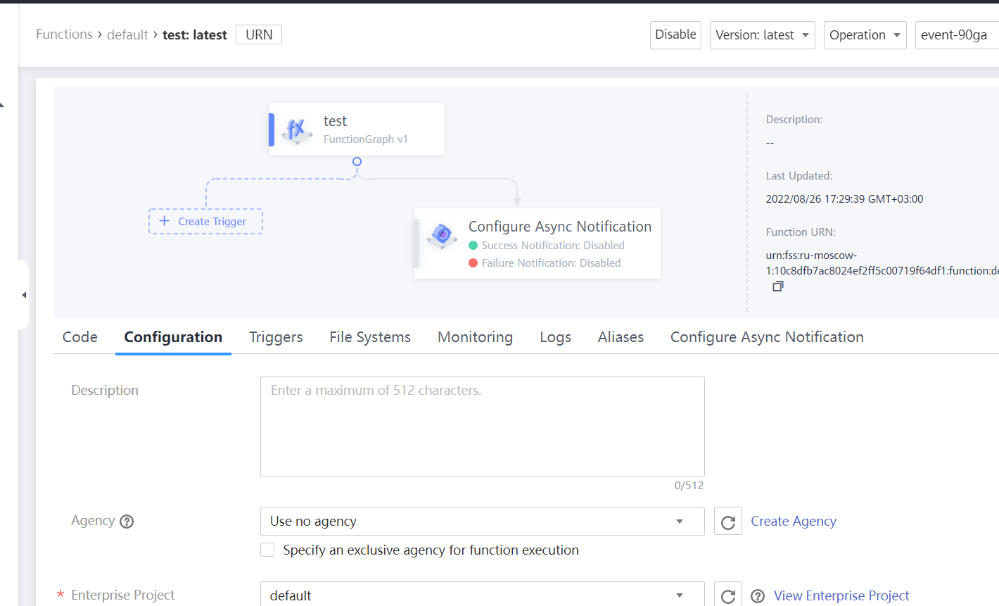

2. Нажимаем кнопку Create Agency
3. В открывшемся окне нажимаем Create Agency
   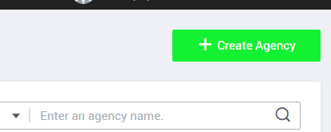

4. В открывшемся окне указываем следующее:
   * Имя создаваемого Agency
   * Agency Type – переключаем на Cloud Service
   * Cloud Service – выбираем FunctionGraph
   * Validity Period – оставляем unlimited
   * Нажимаем кнопку Assign Permissions 
   * В поле поиска вводим VPC, и выбираем права VPC Administrator
   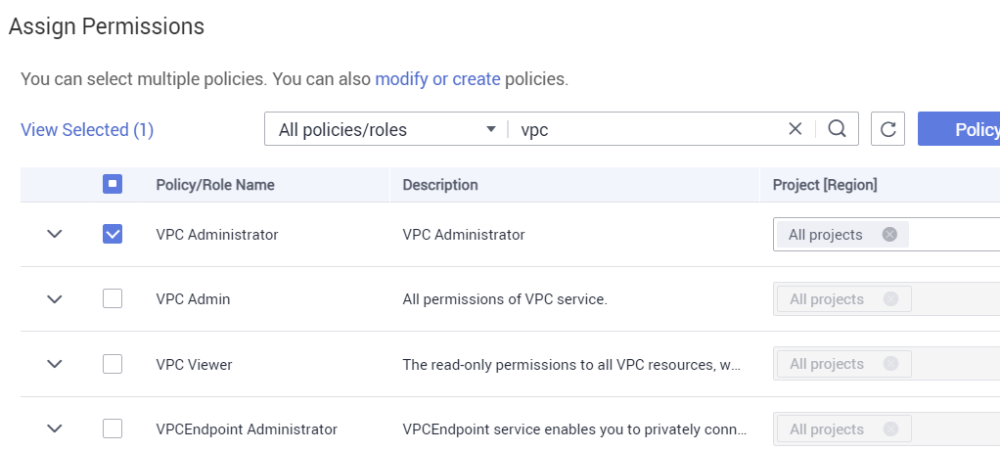
   * Нажимаем кнопку OK
   * Проверяем, что разрешение добавилось
   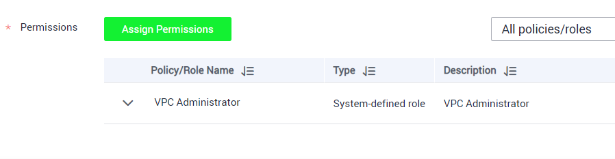
   * Нажимаем кнопку ОК и закрываем вкладку

5.	 Нажимаем кнопку обновить список доступных Agency (кнопка рядом с кнопкой Create Agency)
   

6.	 И в ниспадающем списке Agency выбираем созданный нами
   
 
7.	Теперь можно включить галочку VPC Access, и указать VPC и Subnet, доступ к которому будет иметь наша функция. Выбирать лучше ту же subnet, где располагается наша база данных.
   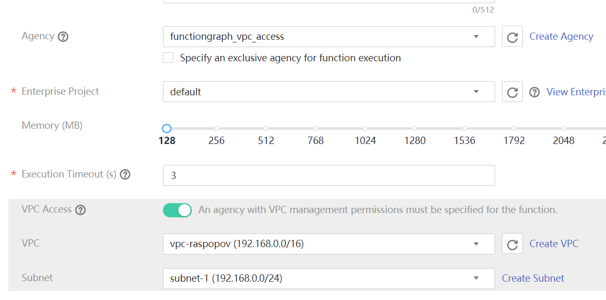
 
Данные настройки необходимо произвести для всех трех функций, после чего в параметрах функций можно будет использовать внутренний IP адрес сервера баз данных, и не нужно будет публиковать его в Интренет.
