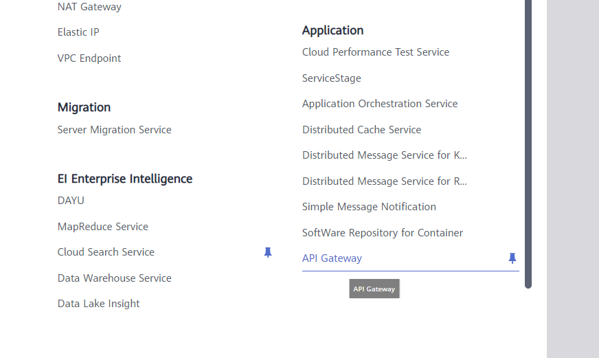
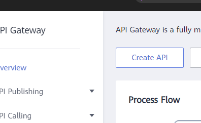
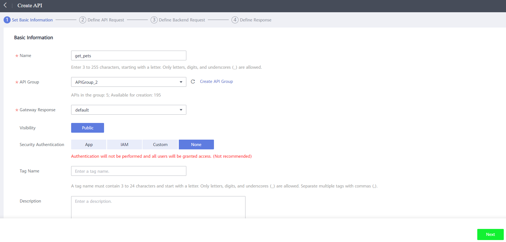
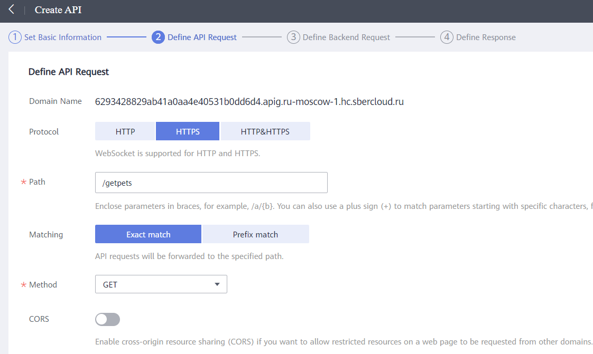
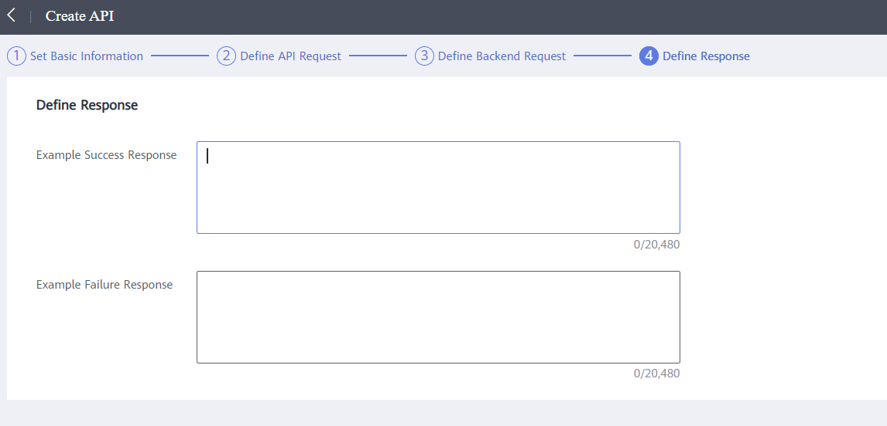
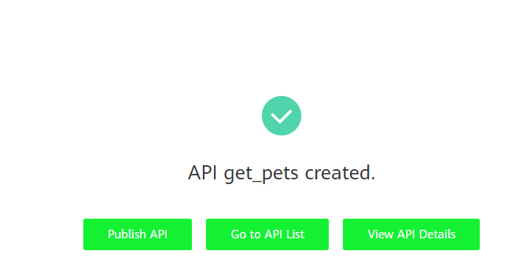
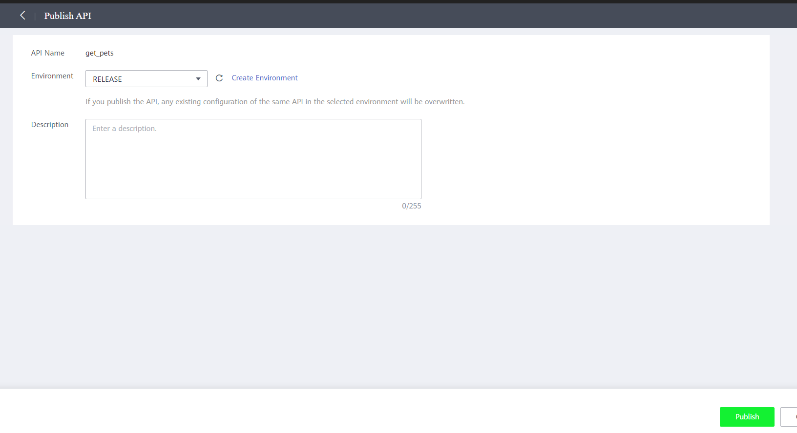

# Публикация функций через API Gateway
Сейчас все наши функции созданы, но использовать их нельзя – у них не настроено какое-либо правило для запуска. Чтобы опубликовать функции в интернет как web сервисы необходимо использовать API Gateway.  

Процесс публикации функций как API:
1. Находим в списке всех сервисов API Gateway 

1. Нажимаем кнопку Create API

   
   
1.	На первой вкладке мастера публикации API необходимо указать следующее:
      * Имя публикуемого API – указываем get_pets
      * Группу API - Все API в одной группе будут использовать одно доменное имя. Выбираем существующую группу, или создаем новую.
      * Gateway Response - Оставляем по умолчанию
      * Security Authentication позволяет навешивать аутентификацию на вызываемые API. Как с ними работать мы рассмотрим чуть позже, теперь же выбираем None.
      * Нажимаем Next

         
 
1.	На следующей вкладке мы должны указать следующее:
      * Протокол, по которому будет работать API – HTTP, HTTPS или оба. Выбираем HTTPS.
      * Путь, по которому будет публиковаться API. Комбинация типа запроса и пути должна быть уникальна для каждого API в одной группе. Необходимо указать следующие API:
         * GET /pets
         * POST /pets
         * DELETE /pets/{id}
      * Matching выбираем Exact Math
      * Метод указываем для каждого API свой
         * GET /pets
         * POST /pets
         * DELETE /pets/{id}
      * Для API удаления питомца необходимо указать входной павраметр, так как мы указали его в пути:
         * Нажимаем на кнопку Add input parameter
         * Имя параметра: id
         * Location: PATH
         * Type: Number
      * Остальные настройки оставляем по умолчанию, и нажимаем Next

         
 
1.	На странице Define Backend Request мы указываем куда именно gateway будет отправлять наши запросы.
      * В Backend Type выбираем FunctionGraph
      * В поле Function URN нажимаем Select Function URN и в открывшемся окне выбираем нужную функцию
      * Остальные настройки оставляем по умолчанию, и нажимаем кнопку Next

         
 
1.	На следующей странице мастера оставляем все по умолчанию, и нажимаем Finish

 
1.	После получения сообщения об успешном создании API необходимо нажать кнопку Publish API для его публикации

8.	Оставляем все настройки публикации по умолчанию, и нажимаем кнопку Publish

Описанную выше операцию необходимо повторить для всех 3х созданных функций, не забывая выбирать правильный метод для каждой функции.
По итогу мы получаем все 3 функции, доступные по одному адресу, но по разным путям.
 
