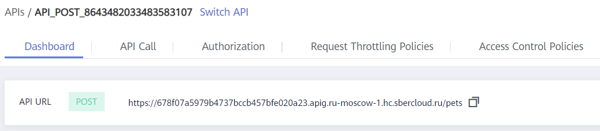
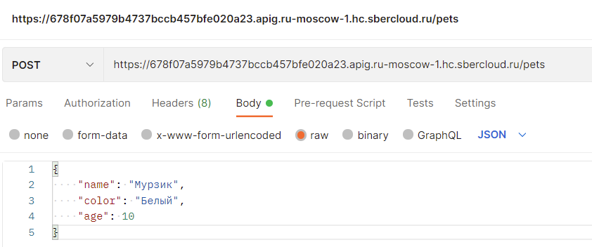
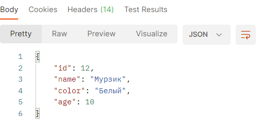
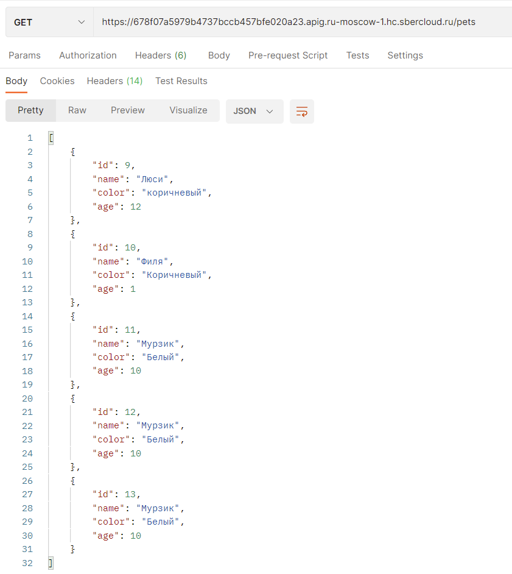
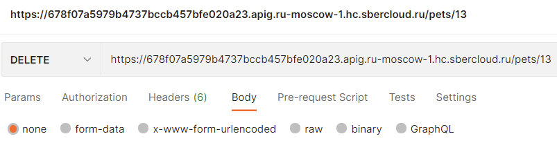

# Тестирование API
Теперь все 3 функции опубликованы, и можно протестировать их работу. Я для этого буду использовать postman, но можно использовать что угодно для тестирования rest api.
Для начала необходимо посмотреть по какому имени доступны наши api. Для этого откроем любую опубликованную API, и посмотрим API URL

 
Теперь попробуем создать запись о домашнем животном, вызвав метод POST. Открываем postman, указываем url до нашего API для создания записи, выбираем настройки Body, указываем его тип – RAW, и что он будет отправляться в виде json.  В текстовом поле указываем параметры, которые мы будем слать в наше API: имя животного, его цвет и возраст. Указывать эти данные необходимо именно в том формате, как приведено в примере ниже.

```json
{
    "name": "Мурзик",
    "color": "Белый",
    "age": 10
}
```

 
После того как адрес и тело запроса указаны, нажимаем кнопку Send. Если все настроено правильно, то в ответ мы получим запись, которая была создана в базе данных.


 
После того, как запись о домашнем питомце была создана в нашей базе данных, мы можем протестировать метод GET. Для этого смотрим в API Gateway какой URL до нашей функции GET, вставляем этот URL в Postman, проверяем, что выставлен правильный тип запроса – GET, и нажимаем Send. В ответе мы увидим массив со всеми записями о домашних питомцах



Аналогичным способом тестируем метод DELETE. Для его работы в поле body необходимо сформировать URL с указанным id и правильно указать тип запроса:

