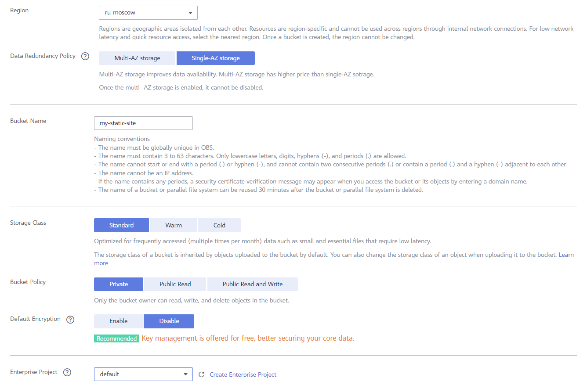
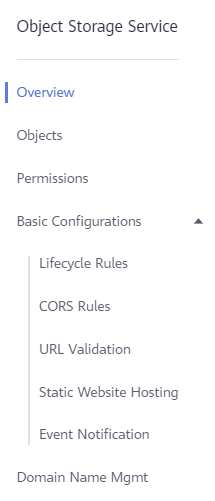
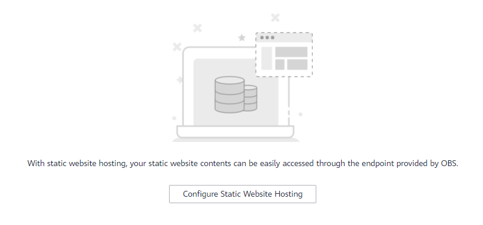
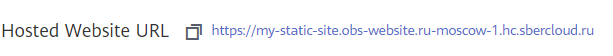

# Публикация статического веб-сайта для работы с API
После того, как все API для нашего приложения сделаны, создадим веб-сайт, который будет работать с ними.
Мы создадим простой Single Page Application и разместим его в OBS с использованием фичи Static Website Hosting в сервисе OBS.

## Создание и настройка бакета
Для работы нашего сайта необходимо создать и правильно настроить бакет, который будет использоваться для хостинга нашего сайта.

1. Открываем консоль облака и выбираем сервис Object Storage Service

1. В правом верхнем углу нажимаем кнопку **Create Bucket**

1. Указываем параметры бакета:

   * Data Redundancy Policy - для текущего проекта можно выбрать Single-AZ Storage
   * Bucket name - указываем произвольно
   * Storage Class - Standard
   * Bucket Policy - Public read
   * Data Encryption - Disable

       

1. Открываем созданный бакет и переходим на страницу **Static Website Hosting**

    

1. Нажимаем кнопку **Configure Static Website Hosting**
   
1. Переводим ползунок **Status** и настраиваем два параметра:

   * Hosting By - Current Bucket
   * Home Page - index.html

      

1. Нажимаем кнопку OK
1. На странице должен отобразиться URL, по которому будет доступен наш сайт

   

