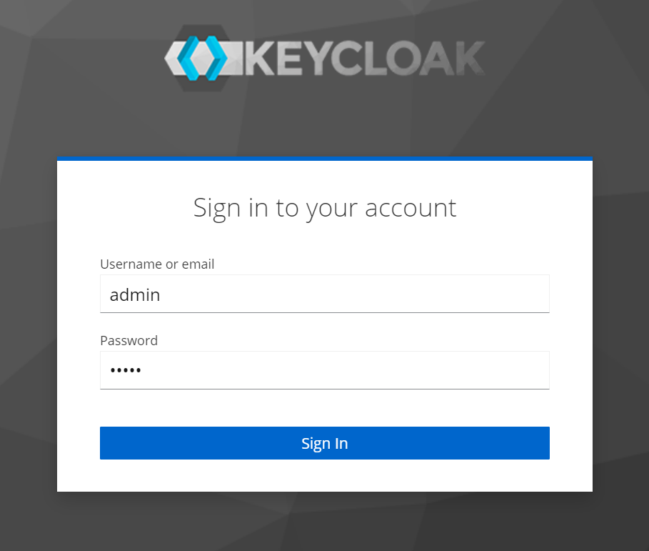

# Создание сервера для аутентификации пользователей (KeyCloak)
Для того, чтобы сделать наш сайт и API защищенными, в первую очередь необходимо создать провайдер, который будет удостоверять наших пользователей.

В качесве примера мы настроим собственный экземпляр KeyCloak, который будет содержать информацию о наших пользователях, а также будет использоваться в качестве провадера для аутентификации с помощью OpenID Connect.

## Создание виртуальной машины
Первым делом нам необходимо создать виртуальную машину с публичным IP адресом, чтобы пользователи нашего сайта могли перейти по ее адресу для аутентификации.

Для начала настроим firewall для нашего будущего сервера:
1. Откройте консоль облака

1. Перейдите в раздел Virtual Private Cloud

1. Откройте страницу Security Groups

   

1. В правой верхней части экрана нажимаем кнопку Create Security Group

1. Указываем параметры создаваемой группы безопасности:

   * Name - keycloak
   * Enterprise project - можно оставить по умолчанию или указать необходимый
   * Template - Custom

      

1. Нажимаем кнопку ОК и в открывшемся диалоговом окне нажимаем Manage Rule
   

1. Переходим на вкладку Inbound Rules и нажимаем кнопку Add Rule

1. Указываем порт 8443 и нажимаем кнопку ОК. Это правиль откроет доступ из интернета к нашему серверу по порту 8443
   

Теперь можно приступить к созданию сервера:

1. Откройте консоль облака

1. Перейдите в раздел Elastic Cloud Server

1. В правой верхней части экрана нажать на кнопку **Create ECS**

1. Указать параметры создаваемой виртуальной машины:

   * AZ - Random
   * Тип виртуальной машины - 2 vCPU, 4 Gb (например, s6.large.2)
   * Image - Ubuntu 20.04
   * System Disk - оставить по умолчанию

      

1. На следующей странице указать сетевые настройки:

   * Выбрать виртуальную сеть и подсеть, в которой будет расположена виртуальная машина
   * Выбрать ранее созданную Security Group
   * EIP - Auto Assign
   * Остальные параметры оставляем по умолчанию

      

1. На следующей странице указываем имя виртуальной машины, а также пароль пользователя root

   

1. На последней странице подтверждаем указанные параметры и запускаем создание виртуальной машины

## Установка KeyCloak
После того, как виртуальная машина создана, мы можем установить Keycloak:
1. Откройте консоль облака

1. Перейдите в раздел Elastic Cloud Server

1. Напротив созданной виртуальной машины нажимаем **Remote login**

   

1. В открывшейся консоли вводим:
   
   * Имя пользователя - root
   * Пароль - тот, который указали при создании виртуальной машины 

   

1. Вводим следующие команды построчно:

   ```sh
   curl -fsSL https://get.docker.com -o get-docker.sh

   sh get-docker.sh

   openssl req -newkey rsa:2048 -nodes -keyout server.key.pem -x509 -days 3650 -out server.crt.pem

   chmod 755 server.key.pem

   docker run -d --name keycloak -e KEYCLOAK_ADMIN=admin -e KEYCLOAK_ADMIN_PASSWORD=admin -e KC_HTTPS_CERTIFICATE_FILE=/opt/keycloak/conf/server.crt.pem -e KC_HTTPS_CERTIFICATE_KEY_FILE=/opt/keycloak/conf/server.key.pem -v $PWD/server.crt.pem:/opt/keycloak/conf/server.crt.pem -v $PWD/server.key.pem:/opt/keycloak/conf/server.key.pem -p 8443:8443 quay.io/keycloak/keycloak:19.0.1 start-dev
   ```

1. По итогам работы у нас на виртуальной машине:
   
   * Установился Docker
   * Создался самоподписанный сертификат SSL
   * Запустился контейнер с Keycloak

## Настройка на стороне KeyCloak
Теперь нам необходимо сделать настройки на стороне Keycloak для работы нашего приложения.

1. Откройте консоль облака
1. Перейдите в раздел Elastic Cloud Server
1. Копируем публичный IP адрес сервера с установленным Keycloak
   
   

1. На новой вкладке браузера открываем адрес https://<скопированный IP адрес>:8443/admin
1. В браузере соглашаемся продолжить несмотря на недоверенный сертификат (это наш сертификат, который мы сгенерировали при установке Keycloak)
1. Заходим в Keycloak
   * Имя пользователя - admin
   * Пароль - admin

      

1. В левом меню выбираем раздел Users и в открывшейся таблице нажимаем на пользователя admin
1. Редактируем пользователя admin:
   * First Name
   * Last Name
   * Email

      

1. Нажимаем кнопку Save

1. В левом меню нажимаем на кнопку Clients

1. Нажимаем на кнопку Create Client

1. На первой странице указываем параметры:

   * Client type - OpenID Connect
   * Client ID - придумываем идентификатор для нашего сайта из OBS

      

1. На следующей странице мастера указываем:
   * Client Authentication - включаем
   * Включаем флажок Implicit flow

      

1. Нажимаем кнопку Save

1. На открывшейся форме редактирования клиента нам необходимо заполнить следующие поля:
   * Root URL - адрес статичного сайта из OBS
   * Home URL - адрес статичного сайта из OBS
   * Valid redirect URIs - адрес статичного сайта из OBS

     

1. Внизу страницы нажимаем кнопку Save


