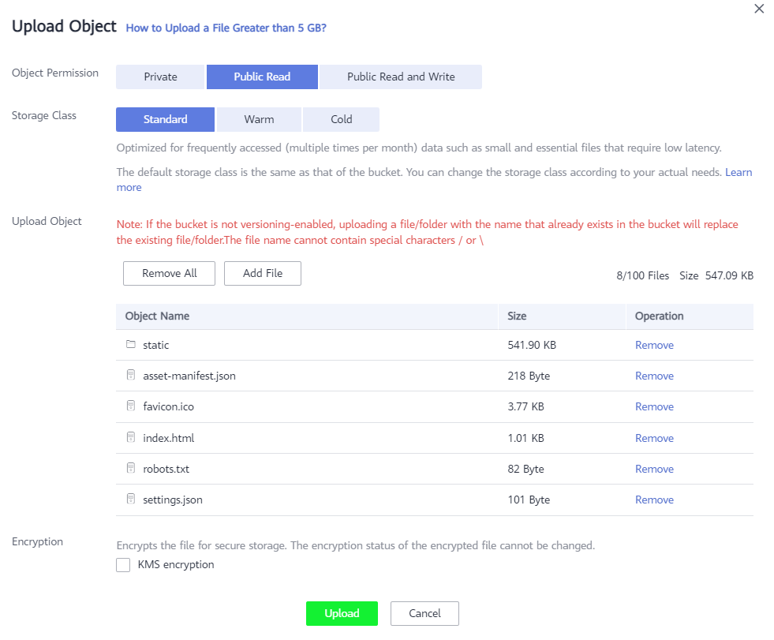

# Аутентификация на сайте
Теперь настало время добавить аутентификацию на нашем сайте с помощью созданного сервера Keycloak.

## Подготовка сайта к публикации (опционально)
Все файлы для публикации сайта уже подготовлены, но если вы хотите самостоятельно подготовить его к публикации, выполните следующее:
1. Откройте папку /source/react-js-oauth-spa
1. Откройте терминал
1. Установите зависимости
   ```
   npm install
   ```
1. Выполните сборку сайта
   ```
   npm run build
   ```

## Публикация сайта
Теперь выполним публикацию сайта в OBS:
1. Перейдите в папку /source/react-js-oauth-spa/build
1. Откройте файл settings.json и укажите URL следующие параметры:

   * api_url - адрес наших API из API Gateway
   * oauth_endpoint - https://<IP адрес сервера Keycloak>:8443/realms/master/protocol/openid-connect/auth
   * client_id - созданный Client ID в Keycloak
   * response_type - id_token+token 
   * scope - profile
   * nonce - произвольная строка
   * redirect_url - адрес сайта в OBS

1. Должен получиться подобный конфигурационный файл:

   ```json
   {
    "api_url": "https://678f07a5979b4737bccb457bfe020a23.apig.ru-moscow-1.hc.sbercloud.ru/pets",
    "oauth_endpoint": "https://178.170.193.144:8443/realms/master/protocol/openid-connect/auth", 
    "client_id": "myobsstaticsite", 
    "response_type": "id_token+token", 
    "scope": "profile", 
    "nonce": "ABCDEFHIJK", 
    "redirect_url": "https://my-static-site.obs-website.ru-moscow-1.hc.sbercloud.ru"
   }
   ```

1. Откройте созданный ранее бакет и перейдите на страницу Objects

   

1. Выделите все файлы в бакете и нажмите кнопку **Delete**

1. Нажмите на кнопку **Upload Object**

   

1. Укажите Object Permission = Public Read

1. С помощью drag-and-drop переместите все файлы из папки /source/react-js-spa/build на форму загрузки

   

1. Нажмите кнопку Upload

1. В левом меню выберите страницу Static WebSite Hosting, скопируйте URL сайта и откройте в новой вкладке

1. При открытии сайта вы будете перенаправлены на страницу KeyCloak для аутентификации, а затем откроется наш сайт

1. В правом верхнем углу должно отражаться имя пользователя

   