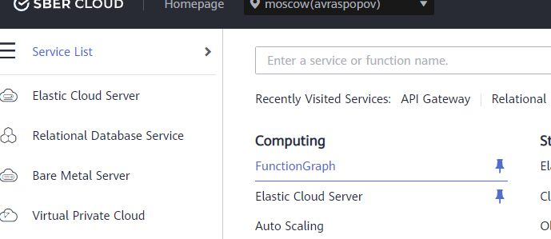
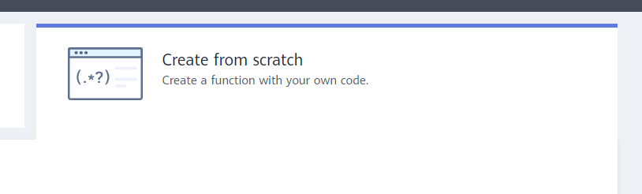
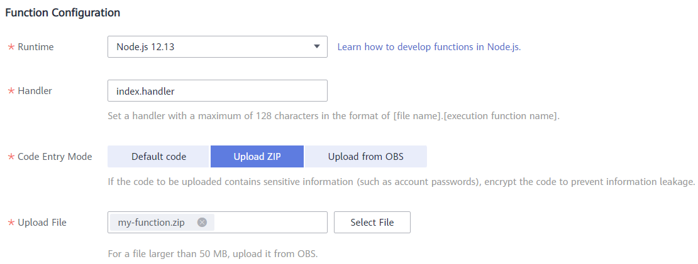

# Аутентификация в API
Теперь каждый пользователь на нашем сайте будет вынужден аутентифицироваться, но наш API все еще доступен любому анонимному пользователю в интернете.
Чтобы решитьэту проблему, наш сайт будет отправлять в наш API access_token, который генерируется Keycloak при аутентификации, и API будет его проверять.

В таком случае нашим API смогут пользоваться только пользователи, созданные в Keycloak и прошедшие аутентификацию на сайте.

# Функция аутентификации
Для реализации аутентификации в API мы создадим отдельную функцию, которую API Gateway будет вызывать при обращении к API для валидации запроса. Мы будем анализировать входящий access_token и разрешать обращение к API только для валидных пользователей.

Ответ от функции аутентификации при этом API Gateway умеет кэшировать, чтобы не добавлять дополнительный вызов функции для каждого обращения к API.

## Создание функции авторизации

Для создания функции авторизации (если вы не хотите создавать функцию самостоятельно, перейдите к разделу Использование готовой функции):

1. Создать директорию для хранения кода функции
1. Инициировать проект
   ```
   npm init -y
   ```
1. Установить зависимости
   ```
   npm install jsonwebtoken
   ```
1. Создать файл index.js и добавить в него следующий код:
   ```javascript
    exports.handler = async (event, context) => {
      const jwt = require('jsonwebtoken');
      const request = require('request');
      const util = require('util');
      const requestWrapper = util.promisify(request);

      const audience = process.env.audience;
      const issuer = process.env.issuer;

      let body = {
         status: "deny"
      };

      try {
         const oauthConfig = await requestWrapper(`${issuer}/.well-known/openid-configuration`);
         const keyUrl = JSON.parse(oauthConfig.body).jwks_uri;
         const keys = await requestWrapper(keyUrl);
         const key = JSON.parse(keys.body).keys[0].x5c[0];
         const signingCertificate = `-----BEGIN CERTIFICATE-----\n${key}\n-----END CERTIFICATE-----`;

         //verify token
         const token = event.headers["x-access-token"];
         const jwttoken = jwt.verify(token, signingCertificate, {audience: audience, issuer: issuer});
      } catch (e) {
         console.log(e);
      }

      const output = {
         "statusCode": 200,
         "body": JSON.stringify(body)
      }

      return output;
   }
   ```

1. Перейти в директорию с кодом, выделить все файлы (index.js, package.json, package-lock.json и папка node_modules) и создать zip архив


Для загрузки функции в облако необходимо выполнить следующие шаги:
1. В списке всех сервисов находим FunctionGraph

   

1. Нажимаем кнопку Create Function

   

1. Проверяем, что выбрана опция Create From Scratch 

   

1. В разделе Basic Information указываем следующее:
   * FunctionGraph Version – оставляем по умолчанию
   * Function name- указываем имя создаваемой функции
   * App – оставляем по умолчанию
   * Agency – оставляем use no agency
   * Enterprise Project – оставляем по умолчанию

      


1. В разделе Function Configuration указываем следующее:
   * Runtime – выбираем Node.js 12.13
   * Handler – имя файла и имя функции, которая должна запускаться - оставляем по умолчанию, если использовали код из примера
   * Code Entry Mode – выбираем Upload ZIP
   * Указываем путь к архиву с исходным кодом нашей функции (создан на шаге 5 алгоритма создания кода функции) и нажимаем Create Function

      

Если функция была успешно создана, то мы увидим окно с её настройками.


Функция ожидает несколько переменных окружения для своей работы и их необходимо указать:
1. В списке функций нажимаем на созданную функцию
1. Открываем вкладку Configuration
1. В разделе Environment Variables нажимаем кнопку Add и добавляем несколько настроек:
   * Идентификатор клиента
      * Key - audience
      * Value - Client ID, который мы указывали в Keycloak
   * Адрес провайдера, выписавшего токен
      * Key - issuer
      * Value - https://<IP адрес сервера Keycloak>:8443/realms/master

1. Нажимаем кнопку Save около каждой настройки


1. В правой верхней части экрана нажимаем кнопку Save, чтобы сохранить функцию

## Использование готовой функции
Если вы хотите использовать уже готовую функцию, сделайте следующее:

1. Перейти в директорию с /source/funtions/authenticator, выделить все файлы (index.js, package.json, package-lock.json и папка node_modules) и создать zip архив

1. В списке всех сервисов находим FunctionGraph

   

1. Нажимаем кнопку Create Function

   

1. Проверяем, что выбрана опция Create From Scratch 

   

1. В разделе Basic Information указываем следующее:
   * FunctionGraph Version – оставляем по умолчанию
   * Function name- указываем имя создаваемой функции
   * App – оставляем по умолчанию
   * Agency – оставляем use no agency
   * Enterprise Project – оставляем по умолчанию

      


1. В разделе Function Configuration указываем следующее:
   * Runtime – выбираем Node.js 12.13
   * Handler – имя файла и имя функции, которая должна запускаться - оставляем по умолчанию, если использовали код из примера
   * Code Entry Mode – выбираем Upload ZIP
   * Указываем путь к архиву с исходным кодом нашей функции и нажимаем Create Function

      

Если функция была успешно создана, то мы увидим окно с её настройками.


Функция ожидает несколько переменных окружения для своей работы и их необходимо указать:
1. В списке функций нажимаем на созданную функцию
1. Открываем вкладку Configuration
1. В разделе Environment Variables нажимаем кнопку Add и добавляем несколько настроек:
   * Идентификатор клиента
      * Key - audience
      * Value - Client ID, который мы указывали в Keycloak
   * Адрес провайдера, выписавшего токен
      * Key - issuer
      * Value - https://<IP адрес сервера Keycloak>:8443/realms/master

1. Нажимаем кнопку Save около каждой настройки


1. В правой верхней части экрана нажимаем кнопку Save, чтобы сохранить функцию


# Настройка API Gateway
После того, как функция авторизации готова, необходимо настроить API Gateway на ее использование.

В первую очередь необходимо создать Custom Authorizer на уровне API Gateway:
1. Находим в списке всех сервисов API Gateway 

   

1. В левом меню выберите пункт Custom Authorizers

   

1. В правой верхней части нажмите на кнопку Create Custom Authorizer

1. Заполните параметры:
   * Name - имя
   * Type - Frontend
   * Function URN - с помощью кнопки Select выберите созданную функцию авторизации
   * Identity Sources - местоположение признака для сохранения кэша - в рамках лабораторной работы можно оставить пустым
   * Max Cache Age - время жизни кэша - в рамках лабораторной работы можно оставить пустым

   

1. Нажмите ОК

Теперь нам необходимо настроить авторизацию для наших API. Мы будем передавать acess_token с нашего сайта в каждом запросе в заголовке X-Access-Token.

Нам необходимо настроить авторизацию для 3 API:
   * GET /pets
   * POST /pets
   * DELETE /pets/{id}

Для каждого API сделайте следующее:
1. В списке API в правой части нажмите кнопку Edit
1. На первой странице укажите:
   * Security Authentication - Custom
   * Custom authorizer - укажите созданный ранее Custom authorizer

      

1. Нажмите Next
1. На второй странице в разделе Input parameters нажмите кнопку Add Input Parameter и добавьте заголовок для передачи токена:
   * Name - X-Access-Token
   * Location - Header
   * Type - String

      

1. Нажмите ОК в диалоговом окне добавления параметра
1. Нажмите Finish
1.	После получения сообщения об успешном создании API необходимо нажать кнопку Publish API для его публикации


8.	Оставляем все настройки публикации по умолчанию, и нажимаем кнопку Publish


После того, как для 3 API настроена авторизация, запросы с помощью Postman перестанут работать, так как не будут содержать необходимый заголовок. Если же добавить вручную заголовок и задать произвольное неверное значение, API вернет ошибку и никаких действий с базой не выполнится.